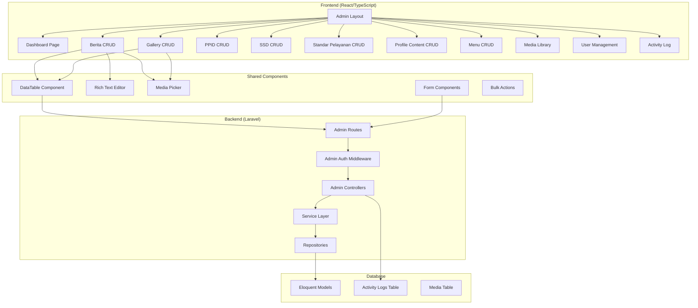

# Design Document: Admin CRUD Management System

## Overview

Sistem Admin CRUD Management adalah panel administrasi komprehensif untuk website Balai Bahasa Provinsi Sulawesi Tenggara. Sistem ini dibangun di atas stack teknologi yang sudah ada (Laravel 11 + Inertia.js + React/TypeScript) dengan menambahkan modul CRUD untuk semua entitas konten.

Tujuan utama adalah menyediakan antarmuka yang user-friendly bagi admin yang minim IT untuk mengelola seluruh konten website tanpa perlu pengetahuan teknis.

### Key Design Decisions

1. **Inertia.js SPA Approach**: Menggunakan Inertia.js untuk seamless navigation tanpa full page reload
2. **Reusable Components**: Komponen React yang dapat digunakan ulang untuk form, table, dan modal
3. **Laravel Resource Controllers**: Mengikuti konvensi RESTful untuk konsistensi
4. **Soft Deletes**: Semua entitas menggunakan soft delete untuk data recovery
5. **Activity Logging**: Setiap perubahan dicatat untuk audit trail

## Architecture



## Components and Interfaces

### Frontend Components

#### 1. AdminLayout Component
```typescript
interface AdminLayoutProps {
  children: React.ReactNode;
  title: string;
  breadcrumbs?: BreadcrumbItem[];
}

interface BreadcrumbItem {
  label: string;
  href?: string;
}
```

#### 2. DataTable Component
```typescript
interface DataTableProps<T> {
  data: PaginatedData<T>;
  columns: ColumnDef<T>[];
  searchable?: boolean;
  searchPlaceholder?: string;
  filters?: FilterConfig[];
  bulkActions?: BulkAction[];
  onSearch?: (query: string) => void;
  onFilter?: (filters: Record<string, string>) => void;
  onBulkAction?: (action: string, ids: number[]) => void;
  onSort?: (column: string, direction: 'asc' | 'desc') => void;
}

interface ColumnDef<T> {
  key: keyof T | string;
  label: string;
  sortable?: boolean;
  render?: (value: any, row: T) => React.ReactNode;
}

interface BulkAction {
  key: string;
  label: string;
  icon?: React.ReactNode;
  variant?: 'default' | 'destructive';
  confirmMessage?: string;
}

interface PaginatedData<T> {
  data: T[];
  current_page: number;
  last_page: number;
  per_page: number;
  total: number;
}
```

#### 3. RichTextEditor Component
```typescript
interface RichTextEditorProps {
  value: string;
  onChange: (value: string) => void;
  placeholder?: string;
  minHeight?: number;
  onImageUpload?: (file: File) => Promise<string>;
  mediaLibraryEnabled?: boolean;
}
```

#### 4. MediaPicker Component
```typescript
interface MediaPickerProps {
  value?: string | string[];
  onChange: (value: string | string[]) => void;
  multiple?: boolean;
  accept?: string[];
  maxSize?: number;
}

interface MediaItem {
  id: number;
  filename: string;
  path: string;
  url: string;
  type: string;
  size: number;
  thumbnail_url?: string;
  created_at: string;
}
```

### Backend Interfaces

#### 1. Admin Controller Base
```php
abstract class AdminCrudController extends Controller
{
    protected string $model;
    protected string $viewPrefix;
    protected array $searchableFields = [];
    protected array $filterableFields = [];
    
    public function index(Request $request);
    public function create();
    public function store(Request $request);
    public function show($id);
    public function edit($id);
    public function update(Request $request, $id);
    public function destroy($id);
    public function bulkAction(Request $request);
}
```

#### 2. Activity Logger Service
```php
interface ActivityLoggerInterface
{
    public function log(
        string $action,
        Model $model,
        ?array $oldValues = null,
        ?array $newValues = null
    ): void;
    
    public function getLogsForModel(Model $model): Collection;
    public function getRecentLogs(int $limit = 50): Collection;
}
```

#### 3. Media Service
```php
interface MediaServiceInterface
{
    public function upload(UploadedFile $file, string $folder = 'uploads'): Media;
    public function generateThumbnail(Media $media): string;
    public function delete(Media $media): bool;
    public function findReferences(Media $media): array;
    public function search(string $query, array $filters = []): Collection;
}
```

## Data Models

### Activity Log Model
```php
// New table: activity_logs
Schema::create('activity_logs', function (Blueprint $table) {
    $table->id();
    $table->foreignId('user_id')->constrained('admin_users');
    $table->string('action'); // created, updated, deleted
    $table->morphs('loggable'); // polymorphic relation
    $table->json('old_values')->nullable();
    $table->json('new_values')->nullable();
    $table->string('ip_address')->nullable();
    $table->string('user_agent')->nullable();
    $table->timestamps();
    
    $table->index(['loggable_type', 'loggable_id']);
    $table->index('created_at');
});
```

### Enhanced Admin User Model
```php
// Update admin_users table
Schema::table('admin_users', function (Blueprint $table) {
    $table->enum('role', ['super_admin', 'admin', 'editor'])->default('editor');
    $table->boolean('is_active')->default(true);
    $table->timestamp('last_login_at')->nullable();
});
```

### Media Model Enhancement
```php
// Ensure media table has required fields
Schema::table('media', function (Blueprint $table) {
    $table->string('thumbnail_path')->nullable();
    $table->json('metadata')->nullable();
    $table->integer('usage_count')->default(0);
});
```

## Correctness Properties

*A property is a characteristic or behavior that should hold true across all valid executions of a system-essentially, a formal statement about what the system should do. Properties serve as the bridge between human-readable specifications and machine-verifiable correctness guarantees.*

Based on the prework analysis, the following consolidated correctness properties have been identified:

### Property 1: File Upload Validation
*For any* file upload attempt, the system SHALL accept the file if and only if the file type is in the allowed list AND the file size is within the maximum limit for that upload context.
**Validates: Requirements 1.3, 3.2, 5.2, 6.3, 8.2**

### Property 2: Slug Generation Consistency
*For any* title string, the auto-generated slug SHALL be URL-friendly (lowercase, hyphens instead of spaces, no special characters) AND unique within the same entity type.
**Validates: Requirements 1.4**

### Property 3: Search Filter Accuracy
*For any* search query on a searchable entity, all returned results SHALL contain the search term in at least one of the searchable fields.
**Validates: Requirements 1.5, 4.4, 8.3**

### Property 4: Bulk Operation Completeness
*For any* bulk action (publish, unpublish, delete) on a set of selected items, the action SHALL be applied to ALL selected items, and the count of affected items SHALL equal the count of selected items.
**Validates: Requirements 1.6**

### Property 5: Data Loading Integrity
*For any* edit operation on an existing entity, the loaded form data SHALL contain all persisted field values matching the database record.
**Validates: Requirements 1.7**

### Property 6: Sort Order Persistence
*For any* reorder operation on orderable items, the new sort_order values SHALL be persisted correctly, and subsequent retrieval SHALL return items in the updated order.
**Validates: Requirements 2.4, 4.3, 5.4, 6.4, 7.3**

### Property 7: Featured Items Constraint
*For any* gallery, the count of items with is_featured=true SHALL NOT exceed the maximum limit (6).
**Validates: Requirements 2.5**

### Property 8: Category Grouping Accuracy
*For any* entity list grouped by category, each item SHALL appear in exactly one group matching its category field value.
**Validates: Requirements 3.1, 6.1**

### Property 9: Single Category Assignment
*For any* categorizable entity, the entity SHALL have exactly one category value (not null, not multiple).
**Validates: Requirements 3.3, 5.3**

### Property 10: Visibility Toggle Effect
*For any* entity with is_active/is_visible toggle, when toggled to false, the entity SHALL NOT appear in public-facing queries.
**Validates: Requirements 3.5, 4.5, 6.5, 7.5**

### Property 11: Menu Depth Constraint
*For any* menu item with a parent, the total nesting depth SHALL NOT exceed 2 levels (parent -> child, no grandchildren).
**Validates: Requirements 7.4**

### Property 12: Media Reference Tracking
*For any* media deletion attempt, if the media is referenced by other entities, the system SHALL prevent deletion and return the list of referencing entities.
**Validates: Requirements 8.5**

### Property 13: Role Validation
*For any* admin user, the role field SHALL contain exactly one value from the predefined set (super_admin, admin, editor).
**Validates: Requirements 9.3**

### Property 14: Deactivated User Authentication Block
*For any* admin user with is_active=false, authentication attempts SHALL fail regardless of correct credentials.
**Validates: Requirements 9.4**

### Property 15: Password Strength Validation
*For any* password change, the new password SHALL meet minimum requirements (8+ characters, mixed case, at least one number).
**Validates: Requirements 9.5**

### Property 16: Activity Log Creation
*For any* create, update, or delete operation on a loggable entity, an activity log entry SHALL be created with correct action type, user_id, and affected entity reference.
**Validates: Requirements 10.1**

### Property 17: Activity Log Filtering
*For any* activity log query with filters (user, action type, date range), all returned entries SHALL match ALL specified filter criteria.
**Validates: Requirements 10.2**

### Property 18: HTML Sanitization Security
*For any* HTML content saved through the rich text editor, the output SHALL NOT contain executable JavaScript or known XSS attack vectors.
**Validates: Requirements 12.3, 12.4**

## Error Handling

### Frontend Error Handling
```typescript
// Centralized error handling for API calls
interface ApiError {
  message: string;
  errors?: Record<string, string[]>;
  status: number;
}

// Toast notifications for user feedback
const handleApiError = (error: ApiError) => {
  if (error.status === 422) {
    // Validation errors - show field-specific messages
    Object.entries(error.errors || {}).forEach(([field, messages]) => {
      toast.error(`${field}: ${messages[0]}`);
    });
  } else if (error.status === 403) {
    toast.error('Anda tidak memiliki akses untuk melakukan aksi ini');
  } else if (error.status === 404) {
    toast.error('Data tidak ditemukan');
  } else {
    toast.error(error.message || 'Terjadi kesalahan');
  }
};
```

### Backend Error Handling
```php
// Custom exception handler for admin routes
class AdminExceptionHandler
{
    public function render($request, Throwable $e)
    {
        if ($e instanceof ValidationException) {
            return back()->withErrors($e->errors())->withInput();
        }
        
        if ($e instanceof ModelNotFoundException) {
            return redirect()->route('admin.dashboard')
                ->with('error', 'Data tidak ditemukan');
        }
        
        if ($e instanceof AuthorizationException) {
            return redirect()->route('admin.dashboard')
                ->with('error', 'Anda tidak memiliki akses');
        }
        
        // Log unexpected errors
        Log::error('Admin Error', [
            'exception' => $e->getMessage(),
            'trace' => $e->getTraceAsString(),
            'user' => auth('admin')->id(),
        ]);
        
        return redirect()->route('admin.dashboard')
            ->with('error', 'Terjadi kesalahan sistem');
    }
}
```

## Testing Strategy

### Dual Testing Approach

This system uses both unit tests and property-based tests for comprehensive coverage:

1. **Unit Tests (PHPUnit)**: Verify specific examples, edge cases, and integration points
2. **Property-Based Tests (Pest + Faker)**: Verify universal properties across generated inputs

### Property-Based Testing Framework

We will use **Pest PHP** with custom property testing helpers for Laravel:

```php
// tests/Pest.php - Property testing setup
uses()->group('property')->in('Feature/Properties');

// Custom property test helper
function property(string $description, Closure $test, int $iterations = 100): void
{
    for ($i = 0; $i < $iterations; $i++) {
        $test();
    }
}
```

### Test Organization

```
tests/
├── Feature/
│   ├── Admin/
│   │   ├── BeritaCrudTest.php
│   │   ├── GalleryCrudTest.php
│   │   ├── PpidCrudTest.php
│   │   ├── SsdCrudTest.php
│   │   ├── StandarPelayananCrudTest.php
│   │   ├── ProfileContentCrudTest.php
│   │   ├── MenuCrudTest.php
│   │   ├── MediaLibraryTest.php
│   │   ├── UserManagementTest.php
│   │   └── ActivityLogTest.php
│   └── Properties/
│       ├── FileUploadValidationPropertyTest.php
│       ├── SlugGenerationPropertyTest.php
│       ├── SearchFilterPropertyTest.php
│       ├── BulkOperationPropertyTest.php
│       ├── SortOrderPropertyTest.php
│       ├── VisibilityTogglePropertyTest.php
│       ├── MenuDepthPropertyTest.php
│       ├── RoleValidationPropertyTest.php
│       ├── PasswordStrengthPropertyTest.php
│       ├── ActivityLogPropertyTest.php
│       └── HtmlSanitizationPropertyTest.php
└── Unit/
    ├── Services/
    │   ├── MediaServiceTest.php
    │   └── ActivityLoggerTest.php
    └── Helpers/
        └── SlugGeneratorTest.php
```

### Property Test Example
```php
// tests/Feature/Properties/SlugGenerationPropertyTest.php
it('generates URL-friendly slugs for any title', function () {
    // **Feature: admin-crud-management, Property 2: Slug Generation Consistency**
    // **Validates: Requirements 1.4**
    
    property('slug is URL-friendly', function () {
        $title = fake()->sentence(rand(3, 10));
        
        $slug = Str::slug($title);
        
        // Slug should be lowercase
        expect($slug)->toBe(strtolower($slug));
        
        // Slug should not contain spaces
        expect($slug)->not->toContain(' ');
        
        // Slug should only contain alphanumeric and hyphens
        expect($slug)->toMatch('/^[a-z0-9-]+$/');
    }, iterations: 100);
});
```
