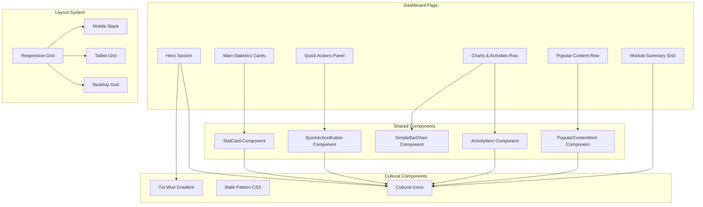

# Design Document: Admin Dashboard UI/UX Enhancement

## Overview

Dokumen ini menjelaskan desain teknis untuk meningkatkan UI/UX Admin Dashboard Balai Bahasa Provinsi Sulawesi Tenggara. Peningkatan berfokus pada:

1. **Tema Tut Wuri Handayani** - Mengintegrasikan filosofi pendidikan Indonesia melalui warna, ikon budaya, dan elemen visual
2. **Human-Crafted Design** - Memastikan antarmuka terasa profesional dan dibuat oleh manusia, bukan generik AI-generated
3. **Responsivitas** - Desain yang bekerja optimal di mobile dan desktop
4. **7 Area Utama** - Dashboard Overview, Quick Actions, Activity Section, Popular News, Popular PPID Documents, Popular Service Standards, Module Summary

### Key Design Decisions

1. **Cultural Icon System**: Menggunakan 8 ikon budaya Indonesia (Lontar, Wayang, Batik, Prasasti, CanangSari, RumahAdat, CepatMenulis, GotongRoyong) secara konsisten
2. **Color Palette**: Primary (yellow #F3A516, black #1A1A1A, white), Secondary (brown #8B4513, green #228B22, red #B22222), Batik colors (blue #1e6091, gold #D4AF37)
3. **Typography**: Playfair Display untuk headings (font-display), Plus Jakarta Sans untuk body (font-sans)
4. **Micro-interactions**: Transisi 300ms untuk hover effects, scale 1.05x untuk buttons
5. **Responsive Breakpoints**: Mobile (<768px), Tablet (768-1024px), Desktop (>1024px)

## Architecture



## Components and Interfaces

### 1. StatCard Component

```typescript
interface StatCardProps {
  title: string
  value: number | string
  description?: string
  icon: React.ReactNode // Cultural icon
  trend?: 'up' | 'down' | 'neutral'
  href?: string
  color?: string // Background color class
}

// Styling requirements:
// - bg-batik-pattern for cultural texture
// - tw-gradient-primary for icon container
// - text-tw-batik-blue for value text
// - hover:shadow-md transition-shadow for interaction
```

### 2. QuickActionButton Component

```typescript
interface QuickActionButtonProps {
  label: string
  icon: React.ReactNode // Cultural icon
  href: string
  variant?: 'default' | 'secondary' | 'outline'
}

// Variant styling:
const buttonClasses = {
  default: 'bg-tw-batik-blue hover:bg-tw-batik-blue/90 text-white',
  secondary: 'bg-tw-batik-gold hover:bg-tw-batik-gold/90 text-tw-black-primary',
  outline: 'border-tw-batik-blue text-tw-batik-blue hover:bg-tw-batik-blue/10',
}

// Interaction: hover:scale-105 transition-all duration-300
```

### 3. ActivityItem Component

```typescript
interface ActivityItemProps {
  activity: {
    id: number
    action: 'created' | 'updated' | 'deleted'
    loggable_type: string
    loggable_id: number
    user_name: string
    created_at: string
    time_ago: string
  }
  isLast?: boolean
}

// Action color mapping:
const actionColors = {
  created: 'bg-green-100 text-green-800',
  updated: 'bg-blue-100 text-blue-800',
  deleted: 'bg-red-100 text-red-800',
}

// Action icon mapping:
const actionIcons = {
  created: LontarIcon,
  updated: CepatMenulisIcon,
  deleted: PrasastiIcon,
}
```

### 4. PopularContentItem Component

```typescript
interface PopularContentItemProps {
  item: {
    id: number
    title: string
    views?: number
    downloads?: number
    type: string
    created_at: string
  }
  metric: 'views' | 'downloads'
  type?: 'berita' | 'ppid' | 'standar'
  rank?: number
}

// Type icon mapping:
const typeIcons = {
  berita: LontarIcon,
  ppid: PrasastiIcon,
  standar: CanangSariIcon,
}

// Rank medals for top 3:
const rankMedals = {
  1: '🥇',
  2: '🥈',
  3: '🥉',
}

// Metric visualization:
// views: 👥 icon with scaled number (value / 100)
// downloads: 📜 icon with scaled number (value / 50)
```

### 5. Module Summary Card

```typescript
interface ModuleSummaryCardProps {
  title: string
  value: number
  icon: React.ReactNode // Cultural icon
  href: string
}

// Styling:
// - Circular icon container: h-12 w-12 rounded-full bg-tw-gradient-primary
// - Value text: text-2xl font-bold text-tw-batik-blue
// - Hover: bg-white/50 hover:bg-white/70 transition-colors
```

## Data Models

### Dashboard Statistics Interface

```typescript
interface DashboardStatistics {
  // Berita
  total_berita: number
  published_berita: number
  draft_berita: number
  total_berita_views: number
  
  // Gallery
  total_gallery: number
  active_gallery: number
  featured_gallery: number
  
  // PPID
  total_ppid_documents: number
  active_ppid_documents: number
  total_ppid_downloads: number
  
  // SSD
  total_ssd: number
  active_ssd: number
  
  // Standar Pelayanan
  total_standar_pelayanan: number
  active_standar_pelayanan: number
  total_standar_downloads: number
  
  // Profile Content
  total_profile_content: number
  active_profile_content: number
  
  // Menu
  total_menus: number
  visible_menus: number
  
  // Media
  total_media: number
  total_images: number
  total_documents: number
  
  // Admin Users
  total_admin_users: number
  active_admin_users: number
  
  // Pengumuman
  total_pengumuman: number
  active_pengumuman: number
}
```

### Popular Content Interface

```typescript
interface PopularItem {
  id: number
  title: string
  views?: number
  downloads?: number
  type: string
  created_at: string
}

interface PopularContent {
  berita: PopularItem[]
  ppid: PopularItem[]
  standar_pelayanan: PopularItem[]
}
```

## Correctness Properties

*A property is a characteristic or behavior that should hold true across all valid executions of a system-essentially, a formal statement about what the system should do. Properties serve as the bridge between human-readable specifications and machine-verifiable correctness guarantees.*

### Property 1: Popular Content Sorting
*For any* list of popular content items (berita, PPID, standar pelayanan), the items SHALL be sorted in descending order by their respective metric (view_count for berita, download_count for PPID and standar pelayanan), and the top 3 items SHALL have medal indicators (🥇, 🥈, 🥉).
**Validates: Requirements 4.1, 5.1, 6.1**

### Property 2: Cultural Icon Consistency
*For any* content item displayed in the dashboard (berita, PPID, standar pelayanan, module cards), the item SHALL display the correct cultural icon based on its type: Lontar for berita, Prasasti for PPID, CanangSari for standar pelayanan, and type-specific icons for module cards.
**Validates: Requirements 4.2, 5.2, 6.2, 10.3**

### Property 3: Activity Action Color Mapping
*For any* activity item with an action type (created, updated, deleted), the badge SHALL display the correct color: green for created, blue for updated, red for deleted, and the correct cultural icon: Lontar for created, CepatMenulis for updated, Prasasti for deleted.
**Validates: Requirements 3.2, 3.3**

### Property 4: Quick Action Navigation
*For any* quick action button, clicking the button SHALL navigate to the correct create form URL: /admin/berita/create for "Tambah Berita", /admin/gallery/create for "Upload Foto", /admin/ppid/create for "Tambah Dokumen PPID", /admin/ssd/create for "Tambah FAQ", /admin/media for "Upload Media".
**Validates: Requirements 2.3**

### Property 5: Module Card Navigation
*For any* module summary card, clicking the card SHALL navigate to the correct module list page: /admin/ssd for SSD, /admin/standar-pelayanan for Standar Pelayanan, /admin/profile-content for Profil Konten, /admin/menu for Menu, /admin/media for Media Files, /admin/users for Admin Users.
**Validates: Requirements 7.4**

### Property 6: Relative Timestamp Display
*For any* activity item with a created_at timestamp, the time_ago field SHALL contain a valid relative time string in Indonesian format (e.g., "2 jam yang lalu", "kemarin", "3 hari yang lalu").
**Validates: Requirements 3.4**

### Property 7: Responsive Grid Layout
*For any* viewport width, the main statistics grid SHALL display: 4 columns for desktop (>1024px), 2 columns for tablet (768-1024px), 1 column for mobile (<768px).
**Validates: Requirements 8.1, 8.2, 8.3**

### Property 8: Empty State Handling
*For any* content list (berita, PPID, standar pelayanan) that is empty, the component SHALL display a friendly empty state message with muted styling instead of rendering an empty container.
**Validates: Requirements 4.5, 5.5, 6.5**

## Error Handling

### Frontend Error Handling

```typescript
// Safe number helper to prevent NaN display
const safeNumber = (value: number | undefined | null): number => {
  return typeof value === 'number' && !isNaN(value) ? value : 0
}

// Default statistics fallback
const defaultStatistics: Statistics = {
  total_berita: 0,
  published_berita: 0,
  // ... all fields default to 0
}

// Merge with defaults to ensure all values exist
const statistics = useMemo(() => ({
  ...defaultStatistics,
  ...(rawStatistics || {}),
}), [rawStatistics])

// Loading state indicator
{!hasStatistics && (
  <div className="flex items-center gap-2 text-amber-600 bg-amber-50 px-3 py-2 rounded-lg">
    <AlertCircle className="h-4 w-4" />
    <span className="text-sm">Memuat data statistik...</span>
  </div>
)}
```

### Backend Error Handling

```php
// Safe count with error handling
private function safeCount(string $modelClass, array $conditions = []): int
{
    try {
        $query = $modelClass::query();
        foreach ($conditions as $column => $value) {
            $query->where($column, $value);
        }
        return $query->count();
    } catch (\Exception $e) {
        Log::warning("Failed to count {$modelClass}: " . $e->getMessage());
        return 0;
    }
}

// Safe sum with error handling
private function safeSum(string $modelClass, string $column): int
{
    try {
        return (int) $modelClass::sum($column);
    } catch (\Exception $e) {
        Log::warning("Failed to sum {$column} from {$modelClass}: " . $e->getMessage());
        return 0;
    }
}
```

## Testing Strategy

### Dual Testing Approach

1. **Unit Tests (Vitest/Jest)**: Verify specific component rendering and behavior
2. **Property-Based Tests**: Verify universal properties across generated inputs

### Property-Based Testing Framework

Menggunakan **fast-check** untuk JavaScript/TypeScript property-based testing:

```typescript
import fc from 'fast-check'

// Example: Testing popular content sorting
fc.assert(
  fc.property(
    fc.array(fc.record({
      id: fc.integer(),
      title: fc.string(),
      views: fc.integer({ min: 0 }),
    })),
    (items) => {
      const sorted = sortByViews(items)
      for (let i = 1; i < sorted.length; i++) {
        expect(sorted[i - 1].views).toBeGreaterThanOrEqual(sorted[i].views)
      }
    }
  )
)
```

### Test Organization

```
tests/
├── Feature/
│   └── Admin/
│       └── DashboardUITest.php
└── js/
    ├── components/
    │   ├── StatCard.test.tsx
    │   ├── QuickActionButton.test.tsx
    │   ├── ActivityItem.test.tsx
    │   ├── PopularContentItem.test.tsx
    │   └── ModuleSummaryCard.test.tsx
    └── properties/
        ├── PopularContentSorting.property.test.ts
        ├── CulturalIconConsistency.property.test.ts
        ├── ActivityActionMapping.property.test.ts
        ├── NavigationRoutes.property.test.ts
        └── ResponsiveLayout.property.test.ts
```

### Property Test Example

```typescript
// tests/js/properties/PopularContentSorting.property.test.ts
import fc from 'fast-check'
import { sortPopularContent, addMedalIndicators } from '@/utils/dashboard'

describe('Property 1: Popular Content Sorting', () => {
  // **Feature: admin-dashboard-uiux, Property 1: Popular Content Sorting**
  // **Validates: Requirements 4.1, 5.1, 6.1**
  
  it('should sort items by metric in descending order', () => {
    fc.assert(
      fc.property(
        fc.array(fc.record({
          id: fc.integer({ min: 1 }),
          title: fc.string({ minLength: 1 }),
          views: fc.integer({ min: 0, max: 100000 }),
        }), { minLength: 0, maxLength: 10 }),
        (items) => {
          const sorted = sortPopularContent(items, 'views')
          
          // Verify descending order
          for (let i = 1; i < sorted.length; i++) {
            expect(sorted[i - 1].views).toBeGreaterThanOrEqual(sorted[i].views)
          }
        }
      ),
      { numRuns: 100 }
    )
  })

  it('should add medal indicators to top 3 items', () => {
    fc.assert(
      fc.property(
        fc.array(fc.record({
          id: fc.integer({ min: 1 }),
          title: fc.string({ minLength: 1 }),
          views: fc.integer({ min: 0 }),
        }), { minLength: 3, maxLength: 10 }),
        (items) => {
          const withMedals = addMedalIndicators(items)
          
          expect(withMedals[0].medal).toBe('🥇')
          expect(withMedals[1].medal).toBe('🥈')
          expect(withMedals[2].medal).toBe('🥉')
          
          // Items beyond top 3 should not have medals
          for (let i = 3; i < withMedals.length; i++) {
            expect(withMedals[i].medal).toBeUndefined()
          }
        }
      ),
      { numRuns: 100 }
    )
  })
})
```

