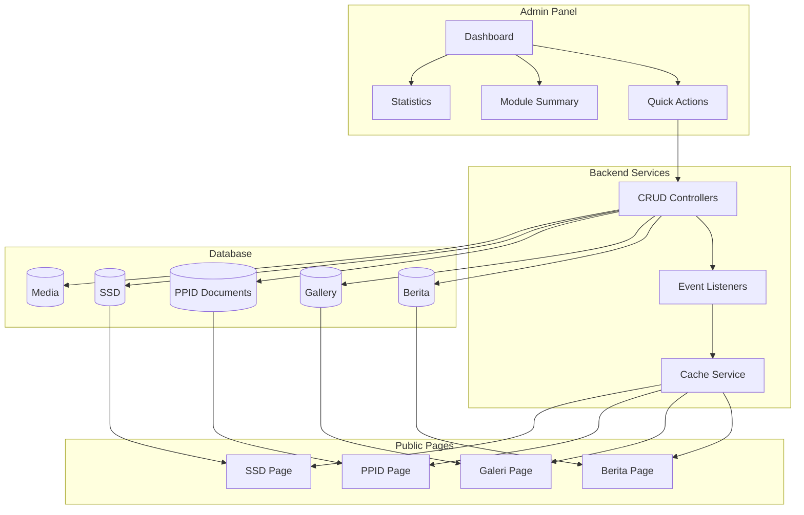

# Design Document: Admin Panel Fixes

## Overview

Dokumen ini menjelaskan desain teknis untuk memperbaiki masalah-masalah krusial pada sistem Admin Panel Balai Bahasa Provinsi Sulawesi Tenggara. Perbaikan mencakup:

1. Perbedaan visual antara admin dan super admin
2. Fungsi aksi cepat (quick actions) di dashboard
3. Ringkasan modul yang akurat
4. Statistik yang terhubung dengan database
5. Koneksi data admin ke halaman publik
6. Cache invalidation untuk update real-time

### Key Design Decisions

1. **Role-Based Visual Distinction**: Menambahkan badge dan styling berbeda untuk super_admin vs admin
2. **Cache Invalidation Strategy**: Menggunakan event-based cache clearing setelah CRUD operations
3. **Data Visibility Filter**: Memastikan filter is_active/is_published konsisten antara admin dan public
4. **Reusable Components**: Memanfaatkan komponen yang sudah ada dengan perbaikan

## Architecture



## Components and Interfaces

### 1. Role Badge Component

```typescript
interface RoleBadgeProps {
  role: 'super_admin' | 'admin';
  size?: 'sm' | 'md' | 'lg';
}

// Styling
const roleStyles = {
  super_admin: 'bg-purple-100 text-purple-800 border-purple-200',
  admin: 'bg-blue-100 text-blue-800 border-blue-200',
};

const roleLabels = {
  super_admin: 'Super Admin',
  admin: 'Admin',
};
```

### 2. Enhanced Dashboard Statistics

```typescript
interface DashboardStatistics {
  // Main stats
  total_berita: number;
  published_berita: number;
  draft_berita: number;
  total_berita_views: number;
  
  // Gallery
  total_gallery: number;
  active_gallery: number;
  featured_gallery: number;
  
  // PPID
  total_ppid_documents: number;
  active_ppid_documents: number;
  total_ppid_downloads: number;
  
  // Module summaries
  active_ssd: number;
  active_standar_pelayanan: number;
  active_profile_content: number;
  visible_menus: number;
  total_media: number;
  active_admin_users: number;
}
```

### 3. Cache Service Interface

```php
interface CacheServiceInterface
{
    public function clearBeritaCache(): void;
    public function clearGalleryCache(): void;
    public function clearPpidCache(): void;
    public function clearSsdCache(): void;
    public function clearAllPublicCache(): void;
}
```

### 4. Model Observer for Cache Invalidation

```php
// App/Observers/BeritaObserver.php
class BeritaObserver
{
    public function created(Berita $berita): void;
    public function updated(Berita $berita): void;
    public function deleted(Berita $berita): void;
}
```

## Data Models

### Existing Models - No Changes Required

Semua model yang diperlukan sudah ada:
- `Berita` - dengan kolom is_published, view_count
- `Gallery` - dengan kolom is_active, is_featured, sort_order
- `PpidDocument` - dengan kolom is_active, category, download_count
- `Ssd` - dengan kolom is_active, sort_order
- `StandarPelayanan` - dengan kolom is_active, download_count
- `ProfileContent` - dengan kolom is_active
- `Menu` - dengan kolom is_visible
- `Media` - dengan kolom mime_type, size
- `AdminUser` - dengan kolom role, is_active

### Query Filters for Public Pages

```php
// Berita - hanya yang published
Berita::where('is_published', true)->get();

// Gallery - hanya yang active
Gallery::where('is_active', true)->orderBy('sort_order')->get();

// PPID - hanya yang active
PpidDocument::where('is_active', true)->get();

// SSD - hanya yang active
Ssd::where('is_active', true)->orderBy('sort_order')->get();
```

## Correctness Properties

*A property is a characteristic or behavior that should hold true across all valid executions of a system-essentially, a formal statement about what the system should do. Properties serve as the bridge between human-readable specifications and machine-verifiable correctness guarantees.*

### Property 1: Role-Based Menu Visibility
*For any* user with a specific role, the sidebar menu SHALL display only menu items that the role is authorized to access, and super_admin SHALL see all menu items while admin SHALL see a subset.
**Validates: Requirements 1.3**

### Property 2: Published Content Visibility
*For any* content item (Berita, Gallery, PPID, SSD) with is_published=true or is_active=true, the item SHALL appear in the corresponding public page query results.
**Validates: Requirements 2.4, 3.4, 4.4, 5.4, 9.1, 10.1, 11.1, 12.1**

### Property 3: Unpublished Content Exclusion
*For any* content item with is_published=false or is_active=false, the item SHALL NOT appear in public page query results.
**Validates: Requirements 9.3, 10.3, 11.3, 12.3**

### Property 4: File Upload Validation
*For any* file upload attempt, the system SHALL accept the file if and only if the file type is in the allowed list AND the file size is within the maximum limit.
**Validates: Requirements 3.2, 4.2, 6.2**

### Property 5: Statistics Accuracy
*For any* dashboard statistics query, the returned counts SHALL match the actual count of records in the database with the appropriate filters applied.
**Validates: Requirements 7.1-7.6, 8.1-8.4**

### Property 6: Cache Invalidation on Create
*For any* content creation operation, the relevant cache keys SHALL be cleared immediately after successful database insertion.
**Validates: Requirements 2.5, 13.1**

### Property 7: Cache Invalidation on Update
*For any* content update operation, the relevant cache keys SHALL be cleared immediately after successful database update.
**Validates: Requirements 13.2**

### Property 8: Cache Invalidation on Delete
*For any* content delete operation, the relevant cache keys SHALL be cleared immediately after successful database deletion.
**Validates: Requirements 13.3**

### Property 9: Download Counter Increment
*For any* document download operation, the download_count field SHALL be incremented by exactly 1.
**Validates: Requirements 4.5, 11.4**

### Property 10: View Counter Increment
*For any* berita view operation, the view_count field SHALL be incremented by exactly 1.
**Validates: Requirements 9.5**

### Property 11: Sort Order Persistence
*For any* reorder operation on orderable items (Gallery, SSD), the new sort_order values SHALL be persisted correctly and subsequent queries SHALL return items in the updated order.
**Validates: Requirements 10.5, 12.4**

### Property 12: Thumbnail Generation
*For any* image upload operation, a thumbnail SHALL be generated and the thumbnail_path SHALL be populated.
**Validates: Requirements 3.5, 6.4**

### Property 13: Metadata Recording
*For any* media upload operation, the metadata fields (filename, size, mime_type) SHALL be populated with correct values.
**Validates: Requirements 6.5**

## Error Handling

### Frontend Error Handling

```typescript
// Toast notifications for user feedback
const handleError = (error: ApiError) => {
  if (error.status === 422) {
    // Validation errors
    toast.error('Data tidak valid. Periksa kembali form Anda.');
  } else if (error.status === 413) {
    // File too large
    toast.error('File terlalu besar. Maksimal 5MB.');
  } else if (error.status === 415) {
    // Unsupported file type
    toast.error('Tipe file tidak didukung.');
  } else {
    toast.error('Terjadi kesalahan. Silakan coba lagi.');
  }
};
```

### Backend Error Handling

```php
// File upload validation
public function validateUpload(UploadedFile $file, array $allowedTypes, int $maxSize): void
{
    if (!in_array($file->getMimeType(), $allowedTypes)) {
        throw new ValidationException('Tipe file tidak didukung');
    }
    
    if ($file->getSize() > $maxSize) {
        throw new ValidationException('File terlalu besar');
    }
}
```

## Testing Strategy

### Dual Testing Approach

1. **Unit Tests (PHPUnit)**: Verify specific examples and edge cases
2. **Property-Based Tests (Pest + Faker)**: Verify universal properties across generated inputs

### Property-Based Testing Framework

Menggunakan **Pest PHP** dengan custom property testing helpers:

```php
// tests/Pest.php
uses()->group('property')->in('Feature/Properties');

function property(string $description, Closure $test, int $iterations = 100): void
{
    for ($i = 0; $i < $iterations; $i++) {
        $test();
    }
}
```

### Test Organization

```
tests/
├── Feature/
│   ├── Admin/
│   │   ├── DashboardStatisticsTest.php
│   │   ├── QuickActionsTest.php
│   │   └── RoleVisibilityTest.php
│   └── Properties/
│       ├── ContentVisibilityPropertyTest.php
│       ├── CacheInvalidationPropertyTest.php
│       ├── FileUploadValidationPropertyTest.php
│       ├── StatisticsAccuracyPropertyTest.php
│       └── CounterIncrementPropertyTest.php
└── Unit/
    └── Services/
        └── CacheServiceTest.php
```

### Property Test Example

```php
// tests/Feature/Properties/ContentVisibilityPropertyTest.php
it('shows published berita on public page', function () {
    // **Feature: admin-fixes, Property 2: Published Content Visibility**
    // **Validates: Requirements 2.4, 9.1**
    
    property('published berita appears in public query', function () {
        $berita = Berita::factory()->create([
            'is_published' => true,
        ]);
        
        $publicBerita = Berita::where('is_published', true)->get();
        
        expect($publicBerita->pluck('id'))->toContain($berita->id);
        
        $berita->delete();
    }, iterations: 100);
});
```

